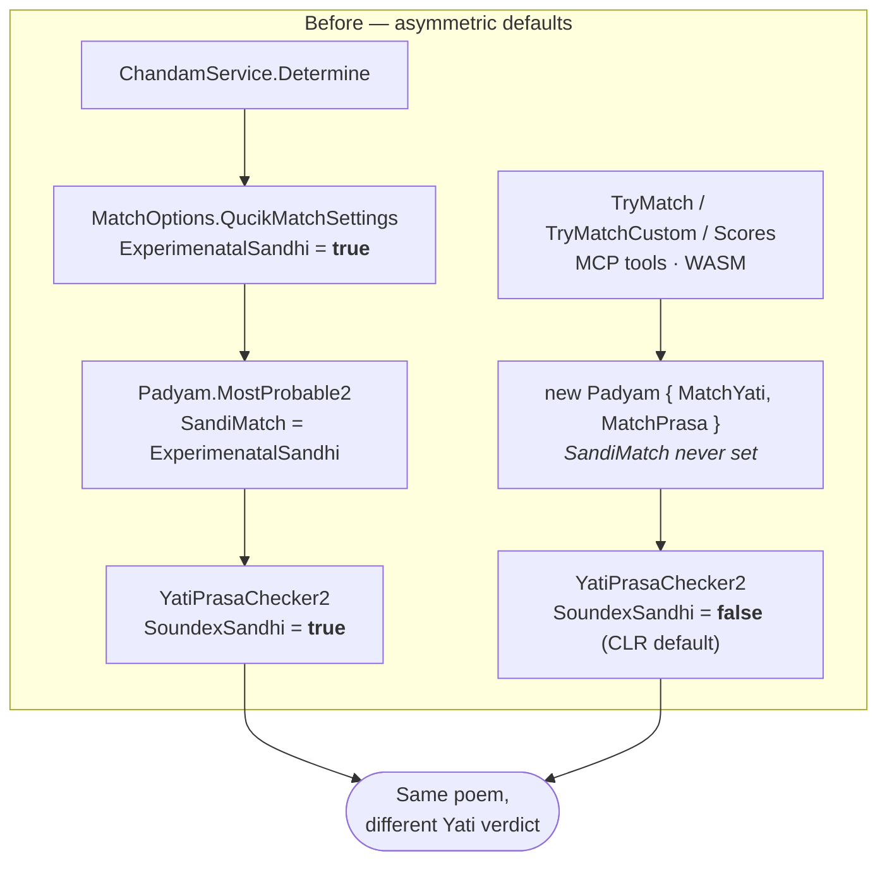
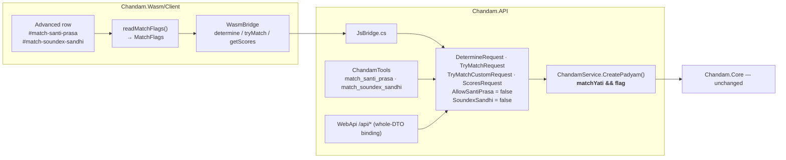

# Design: Expose Santi Prasa / Soundex Sandhi as explicit match options

## Problem & goals

The Compute page exposed only two match toggles — **Yati** and **Prasa**. Two further engine flags materially change matching results but were invisible and unsettable from any surface:

| Flag | Engine read site | Effect |
|---|---|---|
| `AllowSantiPrasa` | `Chandam.Core/Chandam/YatiChecker2.cs:698` (`MatchSantaPrasa`) | Relaxes Prasa: first **or** last consonant may match (శాంతిప్రాసము) |
| `SoundexSandhi` | `Chandam.Core/Chandam/YatiChecker2.cs:430` (`IsYatiMatched` fallback) | Relaxes Yati: match "finish groups" only, skipping the consonant check |

Neither identifier existed in `Chandam.Util`, `Chandam.API`, `Chandam.API.WebApi`, `Chandam.MCP.*`, `Chandam.Wasm`, or `Chandam.Config`. Both were reachable only from inside `Chandam.Core`.

### Root cause: `/determine` was looser than every other entry point



`MatchOptions.QucikMatchSettings` sets `ExperimenatalSandhi = true` (`MatchOptions.cs:33`), which `Padyam.MostProbable2` copies into `Padyam.SandiMatch` (`Padyam.cs:2169`), whose setter writes `YPC.SoundexSandhi`. Every other path constructed `new Padyam { MatchYati, MatchPrasa }` and never touched `SandiMatch`, leaving it at the CLR default `false`.

Result: the same poem could get a different Yati verdict from `/api/determine` than from `/api/try-match`.

### Goals

1. `SoundexSandhi = false` by default on **every** entry point.
2. Both flags become explicit, settable options: API DTOs → WebApi → MCP → WASM.
3. The Compute page gains a low-prominence **Advanced** row: collapsed by default, hidden when Yati is off.

## Requirements / constraints

- **No `Chandam.Core` edits.** Core holds undocumented domain knowledge (`CLAUDE.md` §1). All defaults are set in the API service layer.
- The 554-example baseline (`Chandam.Config/Baselines/baseline-results.yaml`) must not move. It is generated via `TryMatchRequest` (`BaselineGenerator.cs:104`), which was already on the `SoundexSandhi=false` path, so it is structurally unaffected.
- Telugu labels must be authentic, not transliterated placeholders.

## Proposed approach



### The Yati gate lives in the service layer

```csharp
AllowSantiPrasa = matchYati && allowSantiPrasa
SandiMatch      = matchYati && soundexSandhi
```

Enforced once, in `ChandamService.CreatePadyam()` (and mirrored on the `MatchOptions` path in `Determine`). This makes the invariant *"hidden ⇒ inactive"* hold for HTTP, MCP, and WASM callers alike — a client that hides the toggles but forgets to clear them, or a direct API caller that never saw a UI, cannot activate a flag the user believes is off. The UI reset is then a UX nicety rather than the guard.

All six `Padyam` construction sites route through the factory so none silently relies on CLR defaults.

## Alternatives considered

| Alternative | Why rejected |
|---|---|
| Flip the default inside `Chandam.Core` (`MatchOptions.cs`, `YatiChecker3.cs`) | Violates the read-only Core rule; would also change `Chandam.Tasks` and report tooling that legitimately want the looser behaviour. |
| Gate only in the UI (hide the row) | Leaves HTTP/MCP callers able to set a flag with no Yati, and makes correctness depend on client code. |
| Per-flag gating (`SoundexSandhi` on Yati, `AllowSantiPrasa` on Yati **or** Prasa) | More faithful to the engine, but two different rules for two adjacent toggles is harder to explain. Deliberately traded for one rule. |
| Keep six positional booleans across JS interop | Silent failure mode if argument order drifts. Replaced with a `MatchFlags` object, which also removed five duplicated DOM-read sites. |

### Accepted consequence

`AllowSantiPrasa` is also read on the Prasa-proper path (`Padyam.cs:1534`, under `MatchPrasa`), not only via PrasaYati. Keying it off Yati means `MatchYati=false, MatchPrasa=true, AllowSantiPrasa=true` now behaves as `AllowSantiPrasa=false`. This is the cost of having one gating rule instead of two.

## Open questions

- **Auto-detect quality on canonical verse.** With `SoundexSandhi=false`, the classical Indravajramu definition verse (`సామర్థ్యలీలన్ తతజద్విగంబుల్ …`) no longer auto-detects as ఇంద్రవజ్రము. Its line-4 yati (హే ↔ రిం) matches only through the sandhi relaxation, so the rule scores 97% instead of 100%, fails `IsMatched`, and `MostProbable2` falls through to the catch-all `GenricVruttam` (ఏదేని సమ వృత్తం) at 100%. See `status.md` for the measurement. Whether the WASM Compute page should ship with Soundex Sandhi pre-checked is a product decision that remains open.
