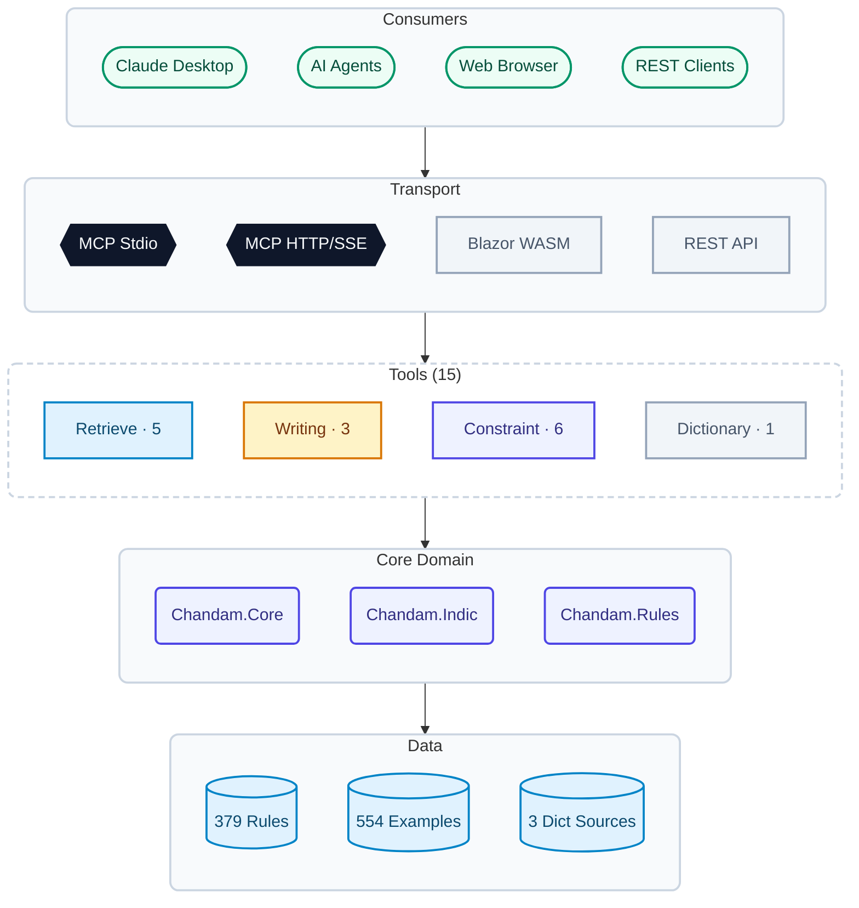

# Chandam (ఛందం) - Telugu Poetry Meter Analysis

> Analyze the meter (prosody) of Telugu, Sanskrit, and Kannada poetry

**Live Site**: https://miriyald.github.io/chandam  
**Website**: https://chandamu.github.io/

Chandam is a comprehensive system for analyzing **prosody** (meter/ఛందం) in Indian classical poetry. It identifies which metrical pattern a poem follows from a database of 379 rules with 96% accuracy.

## 🌟 What is This For?

- **Poets & Students**: Verify if your Telugu poems follow proper meter rules
- **Researchers**: Analyze classical poetry and identify metrical patterns
- **Educators**: Teach prosody with interactive examples
- **Developers**: Build poetry apps with Chandam API
- **AI Agents**: Integrate Telugu poetry analysis into Claude and other AI systems

## 🚀 Quick Start

### Try Online (No Installation)

**Visit the live site:** https://miriyald.github.io/chandam

The web application is automatically deployed from the `beta` branch and requires no installation. Just open the URL and start analyzing Telugu poetry!

### Run Locally

### Option 1: Web Application (Easiest)

**Run locally:**
```bash
dotnet run --project Chandam.Wasm
```
Then open http://localhost:5000 in your browser.

**Using Docker:**
```bash
docker run -d -p 8082:80 ghcr.io/miriyald/chandam-wasm:latest
```
Access at http://localhost:8082

**Features:**
- ✅ Analyze poems in your browser
- ✅ Switch between 14 frequent rules (9KB) or all 379 rules (65KB)
- ✅ View detailed mismatch analysis
- ✅ Get random example poems
- ✅ Works offline (after initial load)
- ✅ Mobile-friendly interface

### Option 2: REST API (For Developers)

**Start the API server:**
```bash
dotnet run --project Chandam.API.WebApi
```
API available at http://localhost:5000

**Example - Analyze a poem:**
```bash
curl -X POST http://localhost:5000/api/determine \
  -H "Content-Type: application/json" \
  -d '{
    "poemText": "తేనెలేని తేటతేనె దొరకునె ధరణిపై",
    "language": "te",
    "matchYati": true,
    "matchPrasa": true
  }'
```

**Using Docker:**
```bash
docker run -d -p 8080:8080 ghcr.io/miriyald/chandam-api:latest
```
Access at http://localhost:8080

See [API Documentation](Chandam.API.WebApi/README.md) for all endpoints.

### Option 3: AI Agent Integration (Claude Desktop)

**Install the MCP server:**

Add to your `claude_desktop_config.json`:
```json
{
  "mcpServers": {
    "chandam": {
      "command": "dotnet",
      "args": ["run", "--project", "C:/path/to/Chandam.MCP.Stdio"]
    }
  }
}
```

Or with Docker (no build needed):
```json
{
  "mcpServers": {
    "chandam": {
      "command": "docker",
      "args": ["run", "-i", "--rm", "ghcr.io/miriyald/chandam-mcp-stdio:latest"]
    }
  }
}
```

**Available AI Tools:**
- `determine_chandam` - Auto-detect meter
- `try_match_chandam` - Test against specific rule
- `calculate_scores` - Get ranked match scores
- `get_rule_info` - Learn about a meter
- `get_examples` - See example poems
- `list_rules` - Browse available meters
- `get_word_meaning` - Look up Telugu word meanings

See [MCP Server Documentation](Docs/plans/phase2-mcp-servers.md) for details.

## 📚 What Can It Do?

### 1. Auto-Detect Meter (Determine)
Paste a Telugu poem and Chandam identifies which meter it follows:
- ✅ Matches against 379 known patterns
- ✅ Shows match percentage
- ✅ Highlights mismatches with explanations
- ✅ Provides rule descriptions in Telugu

### 2. Validate Against Specific Meter (Try Match)
Test if your poem follows a specific meter like *Utpalalmala* or *Sragdhara*:
- ✅ Detailed line-by-line analysis
- ✅ Yati (caesura) checking
- ✅ Prasa (rhyme) verification
- ✅ Gana pattern validation

### 3. Score All Meters (Calculate Scores)
Get a ranked list of how well your poem matches all 379 meters:
- ✅ Useful for finding similar meters
- ✅ Helps when poems partially match multiple patterns
- ✅ Configurable minimum match threshold

### 4. Browse Meters & Examples
Explore the database of classical meters:
- ✅ Filter by type (Vruttam, Jati, UpaJati)
- ✅ Filter by frequency (Frequent, Common, Rare)
- ✅ View example poems with authors
- ✅ Learn pattern structures (Gana, Yati, Prasa)

### 5. Look Up Word Meanings
Get Telugu word definitions from multiple sources:
- ✅ Andhrabharati dictionary
- ✅ Wiktionary
- ✅ Shabdkosh
- ✅ Cached for offline use

## 🌍 Supported Languages

| Language | Code | Native | Rules |
|----------|------|--------|-------|
| **Telugu** | `te` | తెలుగు | 379 |
| Kannada | `kn` | ಕನ್ನಡ | Coming soon |
| Sanskrit | `sa` | संस्कृतम् | Coming soon |
| Hindi | `hi` | हिन्दी | Planned |
| Malayalam | `ml` | മലയാളം | Planned |

*Currently focused on Telugu with 96.09% accuracy across 554 test examples.*

## 📖 Example Usage

### Web Interface

1. Open http://localhost:5000
2. Navigate to "Analyze"
3. Paste your Telugu poem:
   ```
   సామర్థ్యలీలన్ తతజద్విగంబుల్
   భూమిధ్రవిశ్రాంతుల బొంది యొప్పున్
   ```
4. Click "Determine" to auto-detect the meter
5. Or select a specific rule and click "Match"

### API Example (Python)

```python
import requests

response = requests.post('http://localhost:5000/api/determine', json={
    'poemText': 'తేనెలేని తేటతేనె దొరకునె ధరణిపై',
    'language': 'te',
    'matchYati': True,
    'matchPrasa': True
})

result = response.json()
if result['success']:
    match = result['matches'][0]
    print(f"Detected: {match['rule']['name']}")
    print(f"Match: {match['matchPercentage']}%")
```

### Claude Desktop Example

Simply ask Claude:
```
Can you analyze this Telugu poem and tell me which meter it follows?

తేనెలేని తేటతేనె దొరకునె ధరణిపై
జానకీవరుండు లేని జగమందు నెవ్వరున్
```

Claude will use the Chandam MCP tools automatically.

## 🛠️ Installation & Development

### Prerequisites
- **.NET 8.0 SDK** - [Download](https://dotnet.microsoft.com/download/dotnet/8.0)
- **Node.js 20+** (for web UI development) - [Download](https://nodejs.org/)
- **Docker** (optional) - [Download](https://www.docker.com/)

### Build from Source

```bash
# Clone the repository
git clone https://github.com/yourusername/chandam.git
cd chandam

# Build everything
dotnet build Chandam.sln

# Run tests
dotnet test Chandam.MCP.Tests              # 13 MCP tests
dotnet test Chandam.API.IntegrationTests   # 554 example tests
```

### Web UI Development

**Two development modes:**

#### Option 1: Full-Stack Development (.NET + TypeScript)
```bash
# Runs Blazor WASM + serves TypeScript bundle
dotnet run --project Chandam.Wasm

# Open http://localhost:5000
# - Blazor WASM runtime provides C# backend
# - TypeScript UI calls C# methods via JSInvokable
# - Rule loading and analysis happens in C#

# If port 5000 is in use, specify an alternate port:
dotnet run --project Chandam.Wasm --urls "http://localhost:5050"
```

#### Option 2: Frontend-Only Development (TypeScript hot reload)
```bash
cd Chandam.Wasm/Client

# Install dependencies (first time only)
npm install

# Start Vite dev server with hot reload
npm run dev

# Open http://localhost:5050
# ⚠️ WASM backend won't be available - frontend only!
# - Use this for UI/CSS/layout work only
# - Analysis features require the full-stack mode (Option 1)
```

**Production build:**
```bash
# Build TypeScript bundle (integrated with .NET build)
cd Chandam.Wasm/Client
npm run build
# → Outputs to ../wwwroot/js/chandam-app.js

# Or build everything together
dotnet build Chandam.Wasm
# → Automatically runs npm build via MSBuild

# Serve production build
dotnet run --project Chandam.Wasm --configuration Release
```

**Linting:**
```bash
cd Chandam.Wasm/Client
npm run lint  # ESLint 10 with TypeScript rules
```

### Docker Deployment

**Pull pre-built images from GitHub Container Registry (no build required):**

```bash
# Web UI
docker run -d -p 8082:80 ghcr.io/miriyald/chandam-wasm:latest

# REST API
docker run -d -p 8080:8080 ghcr.io/miriyald/chandam-api:latest

# MCP HTTP/SSE server (for remote AI agents)
docker run -d -p 3001:3001 ghcr.io/miriyald/chandam-mcp-http:latest

# MCP Stdio server (for Claude Desktop)
docker run -i --rm ghcr.io/miriyald/chandam-mcp-stdio:latest
```

**Available tags:**
- `latest` / `beta` — most recent build from beta branch
- `YYYYMMdd.HHmmss` — specific version (e.g., `20260511.143022`)

**Or build locally with docker-compose:**

```bash
docker-compose build
docker-compose up -d

# Individual services
docker-compose up chandam-wasm         # Web UI on port 8082
docker-compose up chandam-api          # REST API on port 8080
docker-compose up chandam-mcp-http     # MCP HTTP on port 3001

# View logs
docker-compose logs -f chandam-wasm
```

## 📁 Project Structure

```
Chandam/
├── Chandam.Wasm/              # Web application (TypeScript + Blazor WASM)
├── Chandam.API.WebApi/        # REST API server
├── Chandam.MCP.Stdio/         # MCP server for Claude Desktop
├── Chandam.MCP.Http/          # MCP HTTP/SSE server for remote agents
├── Chandam.Core/              # Core meter analysis engine (DO NOT MODIFY)
├── Chandam.Rules/             # 379 meter rule definitions
├── Chandam.Dictionary/        # Telugu word meaning lookup
├── Chandam.Config/Rules/      # JSON/YAML rule configurations
└── Docs/                      # Documentation & plans
```

See [Project Status](Docs/project-status.md) for detailed architecture.

## Architecture



> For the full architecture with tool details and agent integration scenarios, see [Architecture Diagram](Docs/plans/architecture-diagram.md).

## 🧪 Testing

```bash
# Quick smoke test (13 tests, ~5 seconds)
dotnet test Chandam.MCP.Tests

# Full validation (554 examples, ~2 minutes)
dotnet test Chandam.API.IntegrationTests

# API endpoint tests
bash Docs/Scripts/test-api.sh http://localhost:5000

# Web UI tests (Playwright - coming soon)
# dotnet test Chandam.Wasm.Tests

# Generate code metrics locally (same logic used by GitHub Actions)
powershell -ExecutionPolicy Bypass -File Docs/scripts/metrics-ci.ps1

# Generate + commit metrics locally (without push)
powershell -ExecutionPolicy Bypass -File Docs/scripts/metrics-ci.ps1 -Commit -NoPush
```

## 📖 Documentation

### User Guides
- **[Web UI Guide](Docs/guides/web-ui-guide.md)** - Using the web interface *(coming soon)*
- **[API Guide](Chandam.API.WebApi/README.md)** - REST API reference
- **[MCP Guide](Docs/plans/phase2-mcp-servers.md)** - Claude Desktop integration

### Developer Docs
- **[Project Status](Docs/project-status.md)** - Current state & architecture
- **[Project Rules](PROJECT_RULES.md)** - Code organization standards
- **[Docker Guide](Docs/DOCKER.md)** - Container deployment
- **[Implementation Plans](Docs/plans/)** - Detailed phase plans

### Technical Deep Dives
- **[WASM Compression](Docs/plans/WASM-COMPRESSION-OPTIONS.md)** - Size optimization (92% reduction)
- **[Dictionary System](Docs/plans/phase4-dictionary.md)** - Word lookup implementation
- **[MCP Protocol](Docs/plans/phase2-mcp-servers.md)** - AI agent integration details

## 🤝 Contributing

This project contains 10+ years of domain expertise in Telugu prosody. **Please do not modify** the core analysis engine (`Chandam.Core/`) or rule definitions (`Chandam.Rules/`) without deep domain knowledge.

**Safe areas for contribution:**
- Web UI improvements (Chandam.Wasm)
- API enhancements (Chandam.API)
- Documentation
- Test coverage
- New language support
- Performance optimization

See [PROJECT_RULES.md](PROJECT_RULES.md) for detailed guidelines.

## 🎯 Roadmap

- [x] **Phase 1**: REST API with 379 Telugu rules ✅
- [x] **Phase 2**: MCP servers for AI agent integration ✅
- [x] **Phase 4**: Dictionary/word meaning lookup ✅
- [x] **Phase 5**: Web UI with TypeScript/WASM ✅
- [ ] **Phase 5b**: UI/UX polish (design, animations, accessibility)
- [ ] **Phase 6**: Mobile apps (iOS/Android via MAUI)
- [ ] **Phase 7**: Kannada & Sanskrit rule sets
- [ ] **Phase 8**: Collaborative features (annotations, sharing)

See [Project Status](Docs/project-status.md) for details.

## 🌐 GitHub Pages Deployment

The web application is automatically deployed to GitHub Pages on every push to the `beta` branch.

**Live Site**: https://miriyald.github.io/chandam

### Versioning

Version is defined centrally in [Directory.Build.props](Directory.Build.props):

```xml
<PropertyGroup>
  <ChandamVersion>0.0.2</ChandamVersion>
</PropertyGroup>
```

This version flows to all artifacts:
- **Web UI**: Footer shows `v0.0.0 (dev)` locally, `vYYYYMMdd.HHmmss (Published: date)` after publish
- **Docker images**: Tagged as `YYYYMMdd.HHmmss` (UTC build timestamp)
- **NuGet package**: `YYYYMMdd.HHmmss-beta`

To release a new version, update `<ChandamVersion>` in `Directory.Build.props`.

### Deployment Workflow

```bash
# Make changes on beta branch
git checkout beta

# Update version if needed (optional)
# Edit Chandam.Wasm/Chandam.Wasm.csproj: <Version>0.0.3</Version>

git commit -m "Your changes"
git push origin beta

# GitHub Actions automatically:
# 1. Builds TypeScript + .NET (with version injection)
# 2. Deploys to gh-pages branch
# 3. Site updates at miriyald.github.io/chandam (~5 min)
```

**Workflow status**: https://github.com/miriyald/chandam/actions

### Files

- **[Chandam.Wasm/Chandam.Wasm.csproj](Chandam.Wasm/Chandam.Wasm.csproj)** - Version number + MSBuild injection target
- **[.github/workflows/deploy-pages.yml](.github/workflows/deploy-pages.yml)** - Deployment workflow
- **[.github/scripts/prepare-github-pages.sh](.github/scripts/prepare-github-pages.sh)** - Post-publish script (base href, navigation)

## ❓ FAQ

**Q: Do I need internet connection?**  
A: No! The web app works offline after initial load. Rule files are cached locally.

**Q: Which meter should I use for my poem?**  
A: Use "Determine" mode - it will automatically detect the best matching meter from all 379 options.

**Q: Why does my poem show 85% match instead of 100%?**  
A: Classical meters have strict rules. The tool highlights exactly where mismatches occur (syllable count, Yati position, Prasa, etc.) so you can adjust your poem.

**Q: Is there a graph/explore view of the rules?**  
A: Yes — navigate directly to `/explore/chandam/` or `/explore/topella/` for an interactive D3 force-directed graph showing the taxonomy (PadyamType → SubType → ChandamName → Rules). This is an experimental hidden feature not exposed in the main UI.

**Q: Can I add my own custom meters?**  
A: Currently no - the rule definitions require deep domain expertise. File an issue if you have a valid meter to contribute.

**Q: Is this accurate?**  
A: 96.09% accuracy across 554 tested examples from classical Telugu literature. Some edge cases may require manual verification.

**Q: Can I use this for other languages?**  
A: Kannada and Sanskrit support is planned. The architecture supports multiple Indic languages.

## 📜 License

Copyright 2013-2026 Chandam-ఛందం (http://chandam.apphb.com)

## 🙏 Acknowledgments

Built upon 10+ years of classical Telugu prosody research and domain expertise.

Special thanks to the original Chandam team and contributors from the Telugu literary community.

---

**Need help?** Open an issue on GitHub or check the [documentation](Docs/).

**Building AI apps?** See [MCP Integration Guide](Docs/plans/phase2-mcp-servers.md).

**Want to contribute?** Read [PROJECT_RULES.md](PROJECT_RULES.md) first.
